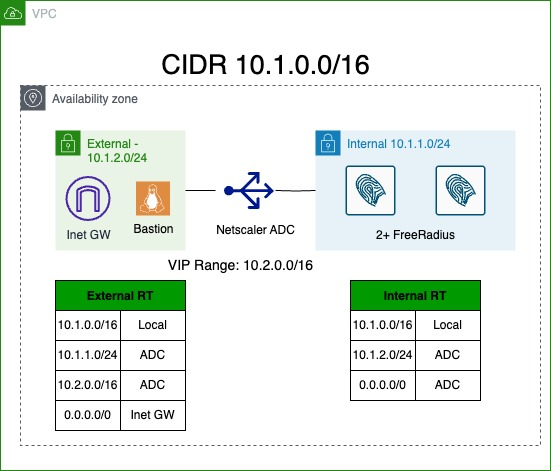

# Free RADIUS with Netscaler Load Balancer
This template will deploy two or more Frre RADIUS Servers behind a Netscaler ADC load balancer.

The template will fully configure the load balancer and the Free RADIUS nodes, albeit with minimal settings.

FreeRADIUS servers are configured with username cisco and password cisco.

Full walk through of ADC configuration can be found at https://securityccie.net/2024/11/18/netscaler-for-ise-deployments/

The topology of the deployment is shown on the diagram

# Password
This template contains a random_password resource that generates a password which is used for the following:
- admin user for F5 GUI
- iseadmin user for ISE GUI
- f5probe user password
- RADIUS shared key for F5 network device that's created in ISE

The password is displayed in terraform outputs

# Resources
The following resources are provisioned:
- VPC to hold all other components. For simplicity all the resources are deployed in the same Availability Zone. 10.1.0.0/16 is the VPC CIDR
- Internet Gateway
- Internal subnet (10.1.1.0/24)
- External subnet (10.1.2.0/24)
- 2 or mode Ubuntu Servers. The number is defined in radius_count variable. Servers are connected to Internal subnet.
- ADC load balancer Freemium Edition.
-- Management interface is connected to Management subnet
-- Internal interface is connected to Internal subnet
-- External Interface is connected to External subnet
- Bastion host. This host runs Amazon Linux and is open for SSH from IP addresses defined in Management Access security group.
-- The host is connected to external subnet and is assigned a public IP address

# Routing
For VIP, we need to use an IP range that is outside of the CIDR range of the VPC. AWS would not allow us to route a subnet that conflicts with a VPC towards Netscaler. 10.2.0.0/16 is used for VIP Range. 

In order to RADIUS to properly integrate with ADC, the load balancer must be inline between ISE and the network.

In order to achieve that, we have a route on the External subnet pointing to ADC as the gateway to reach the Internal subnet.

To be able to to connect to the VIP from the Bastion host for testing purposes, we have a route from Internal subnet to the External subnet via the ADC

Default gateway on the Internal subnet points to ADC.

Default gateway on the External subnet points to Internet Gateway. This is mainly to be able to communicate to the Bastion host

For more information about inserting an appliance between two VPC subnets, please see this blog post from AWS: https://securityccie.net/2024/11/18/netscaler-for-ise-deployments/

# ADC configuration
ADC pre boot configuration is used to configure the load balancer

*adc-config.tftpl* file contains the template for that configuration

Most of the commands were derived by configuring the ADC from the GUI and using *show run* to get the correct CLI command.

Please see the write up above configuration details.

# Accessing provisioned hosts

Bastion linux host is the only thing that's directly accessible from the Internet, although it's restricted to specific source IP addresses.

ADC CLI and GUI use **nsroot** username with the password matching the instance id, eg. i-0261ed2fb8460a61d. When logging in to the GUI, the netscaler will prompt to change the password.

It is not possible to login to ADC until the password is changed through the GUI

To access the GUI, SSH dynamic tunneling can be used to create a SOCKS proxy that we can point a browser to.