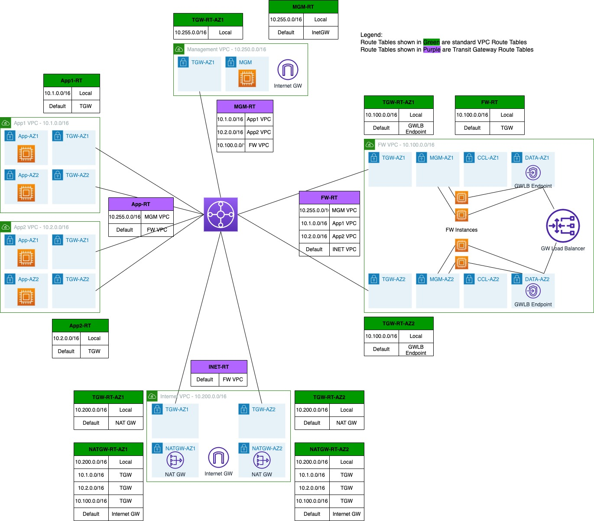

# FTD Cluster Gateway Load Balancing

This template will provision resources to test Gateway Load Balancing with FTD firewalls configured as a cluster.
The topology that's created is shown following diagram.

As of version 7.3, FTD does not support clustering across multiple availability zones. This template will provision separate clusters in each availability zone. These clusters need to be individually added to FMC.

All files have comments in them describing the purpose of various resources