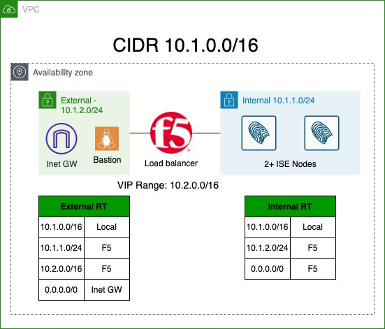

# ISE with F5 Load Balancer
This template will deploy two or more ISE nodes behind an F5 load balancer.

The template will fully configure F5 and the ISE nodes, albeit with minimal settings

Full walk through of this template can be found at https://securityccie.net/blah

The topology of the deployment is shown on the diagram

# Password
This template contains a random_password resource that generates a password which is used for the following:
- admin user for F5 GUI
- iseadmin user for ISE GUI
- f5probe user password
- RADIUS shared key for F5 network device that's created in ISE

The password is displayed in terraform outputs

# Resources
The following resources are provisioned:
- VPC to hold all other components. For simplicity all the resources are deployed in the same Availability Zone. 10.1.0.0/16 is the VPC CIDR
- Internet Gateway
- Internal subnet (10.1.1.0/24)
- External subnet (10.1.2.0/24)
- 2 or mode ISE nodes. The number is defined in ise_count variable. ISE nodes are connected to Internal subnet.
- DNS records for each ISE node. This is required for nodes to correctly communicate with one another.
- F5 load balancer. PAYG AMI is used to avoid needing to license it.
-- Management interface is connected to Internal subnet
-- Internal interface is connected to Internal subnet
-- External Interface is connected to External subnet
- Bastion host. This host runs Amazon Linux and is open for SSH from IP addresses defined in Management Access security group.
-- The host is connected to external subnet and is assigned a public IP address
- DNS record for the Bastion host

# Routing
For VIP, we need to use an IP range that is outside of the CIDR range of the VPC. AWS would not allow us to route a subnet that conflicts with a VPC towards the F5. 10.2.0.0/16 is used for VIP Range. 

In order to ISE to properly integrate with F5, the load balancer must be inline between ISE and the network.

In order to achieve that, we have a route on the External subnet pointing to F5 as the gateway to reach the Internal subnet.

To be able to to connect to the VIP from the Bastion host for testing purposes, we have a route from Internal subnet to the External subnet via the F5

Default gateway on the Internal subnet points to F5.

Default gateway on the External subnet points to Internet Gateway. This is mainly to be able to communicate to the Bastion host

For more information about inserting an appliance between two VPC subnets, please see this blog post from AWS: https://aws.amazon.com/blogs/aws/inspect-subnet-to-subnet-traffic-with-amazon-vpc-more-specific-routing/

# F5 configuration
Cloud-init is used to configure the F5 as described here: https://clouddocs.f5.com/cloud/public/v1/shared/cloudinit.html

*f5-cloud-init.tftpl* file contains the template for that configuration

Most of the commands were derived by configuring the F5 from the GUI and using *show running-config ltm* to get the correct CLI command.

The following tasks are performed on the F5:
- Sets the admin password
- Disables GUI Setup Wizard
- Creates Internal and External VLANs
- Separate routing domain is created for Internal and External interfaces with ID of 10. This allows us to isolate routing on data interfaces and the management interface.
- Assigns IP addresses to Internal and External interfaces
- Sets default gateway
- Creates RADIUS Health Check
- Creates Calling-Station-ID RADIUS Profile
- Creates ISE Pool with RADIUS Monitor
- Creates ISE Nodes and adds them to the Pool
- Creates Virtual Servers for :1812 and 1813, pointing to the Pool and using Calling-Station-ID profile
- Creates Passthrough VIP
- Creates SNAT Pool for CoA
- Creates Virtual Server for UDP/1700 to be NATd to the SNAT Pool
- Saves the config

# ISE Configuration
Ansible is used to configure ISE. It is launched on the Bastion host automatically using null_resource.

The inventory for ansible is generated by terraform using *ansible-inv.tftpl* template.

Ansible playbook is defined in *ise-provision.yml* file.

The playbook supports 2 or more nodes. The first ISE instance becomes Primary Admin, the second Secondary Admin. The remaining nodes are provisioned as PSNs

Ansible playbook performs the following tasks:
- Using generic URI module, waits for ISE ERS API to be accessible. This could take close to 30 minutes
- Installs Root CA Certificate from a supplied file
- Installs System Certificate and Key using a supplied file
- Waits for ISE to restart after certificate install
- Updates Primary Admin node from Standby to Primary mode
- Joins all the nodes into the deployment

# Accessing provisioned hosts

Bastion linux host is the only thing that's directly accessible from the Internet, although it's restricted to specific source IP addresses.

F5 CLI is utilizes SSH public key authentication using the public key specified in resource definition. Username for F5 is **admin**

ISE CLI is utilizes SSH public key authentication using the public key specified in resource definition. Username for ISE is **iseadmin**

F5 and ISE GUI use the radomly generated password that was mentioned at the top of this document. Usernames are the same as CLI. Note that ISE will require the password to be change on the first login into the GUI.

To access the GUI, SSH dynamic tunneling can be used to create a SOCKS proxy that we can point a browser to.