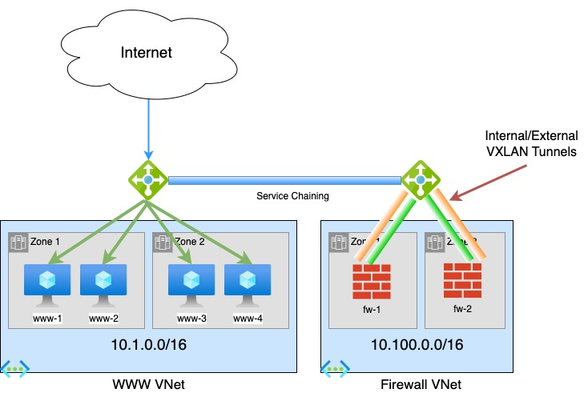

# Azure FTD Cluster with Gateway Load Balancing

This template will provision an FTDv cluster in Azure in a topology shown below.

The cluster is automatically added to CDO using ansible.

Full write up is available here: https://www.securityccie.net/2023/04/26/deploying-cdo-managed-ftdv-cluster-in-azure/

