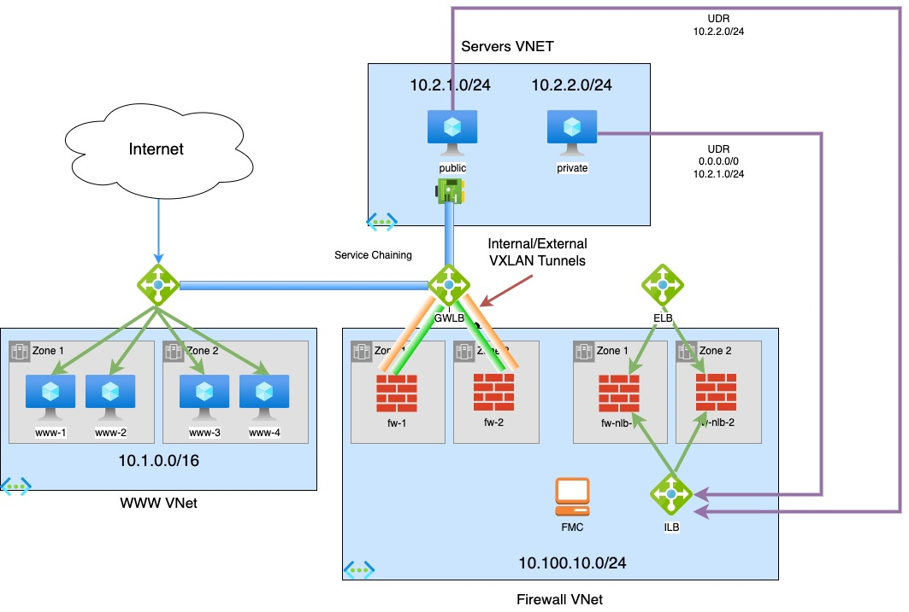

# Azure FTD Deployment with FMC

This template will deploy GWLB and firewall sandwitch topologies as shown on the diagram below.

FMC is also deployed and placed in the same subnet as firewall management interfaces

